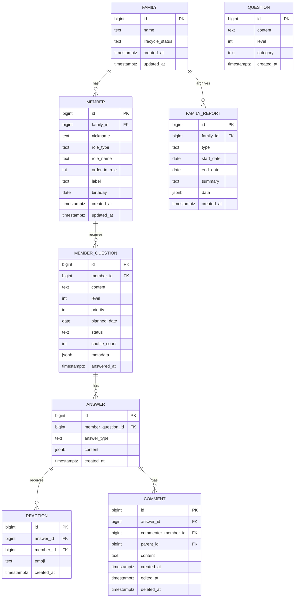

# 온식구 AI 데이터베이스 스키마
> 문서 버전: 2026-01-10 (v2.2 - MEMBER 역할 세분화 & 질문 우선순위 도입)
---

## 📊 ERD



---

## 📋 테이블 상세

### FAMILY

가족 단위의 루트 엔터티

| 컬럼 | 타입 | 제약 | 설명 |
|------|------|------|------|
| `id` | BIGSERIAL | PK | 가족 고유 ID |
| `name` | TEXT | NOT NULL | 가족 이름 |
| `lifecycle_status` | TEXT | | 가족 상태: `바쁨` \| `평소` \| `행사` \| `변화` |
| `created_at` | TIMESTAMPTZ | DEFAULT now() | 생성 시각 |
| `updated_at` | TIMESTAMPTZ | DEFAULT now() | 수정 시각 |

```sql
CREATE TABLE family (
    id                  BIGSERIAL PRIMARY KEY,
    name                TEXT NOT NULL,
    lifecycle_status    TEXT,
    created_at          TIMESTAMPTZ DEFAULT now(),
    updated_at          TIMESTAMPTZ DEFAULT now()
);
```

---

### MEMBER

가족 구성원

| 컬럼 | 타입 | 제약 | 설명 |
|------|------|------|------|
| `id` | BIGSERIAL | PK | 구성원 고유 ID |
| `family_id` | BIGINT | FK, NOT NULL | 소속 가족 |
| `nickname` | TEXT | NOT NULL | 화면 표시용 (공주님, 울아빠 등) |
| `role_type` | TEXT | | 시스템 로직용 (PARENT, CHILD 등) |
| `role_name` | TEXT | | 정규화된 호칭 (아빠, 엄마, 딸 등) |
| `order_in_role` | INT | DEFAULT 1 | 순서 (첫째, 둘째 등) |
| `label` | TEXT | | 관계 맥락 압축 (첫째 딸, 막내, 서울 큰엄마 등) |
| `birthday` | DATE | | 생년월일 |
| `created_at` | TIMESTAMPTZ | DEFAULT now() | 가입 시각 |
| `updated_at` | TIMESTAMPTZ | DEFAULT now() | 수정 시각 |

```sql
CREATE TABLE member (
    id              BIGSERIAL PRIMARY KEY,
    family_id       BIGINT NOT NULL REFERENCES family(id) ON DELETE CASCADE,
    nickname        TEXT NOT NULL,
    role_type       TEXT,
    role_name       TEXT,
    order_in_role   INT DEFAULT 1,
    label           TEXT,
    birthday        DATE,
    created_at      TIMESTAMPTZ DEFAULT now(),
    updated_at      TIMESTAMPTZ DEFAULT now()
);

CREATE INDEX idx_member_family ON member(family_id);
CREATE INDEX idx_member_role_type ON member(role_type);
```

---

### QUESTION

질문 템플릿 (운영자가 등록하는 시드 데이터, 참조용)

| 컬럼 | 타입 | 제약 | 설명 |
|------|------|------|------|
| `id` | BIGSERIAL | PK | 질문 고유 ID |
| `content` | TEXT | NOT NULL | 질문 본문 |
| `level` | INT | DEFAULT 1 | 난이도 1~4 (1~2: 가벼운 주식, 3~4: 깊은 특별식) |
| `category` | TEXT | | 카테고리: `일상` \| `추억` \| `감정` \| `미래` \| `취미` \| `관계` |
| `created_at` | TIMESTAMPTZ | DEFAULT now() | 생성 시각 |

```sql
CREATE TABLE question (
    id          BIGSERIAL PRIMARY KEY,
    content     TEXT NOT NULL,
    level       INT DEFAULT 1 CHECK (level BETWEEN 1 AND 4),
    category    TEXT,
    created_at  TIMESTAMPTZ DEFAULT now()
);

CREATE INDEX idx_question_level ON question(level);
CREATE INDEX idx_question_category ON question(category);
```

> **참고:** QUESTION은 템플릿 풀로만 사용됩니다. 신규 멤버 가입 시 MEMBER_QUESTION에 복사됩니다.

---

### MEMBER_QUESTION

멤버별 실제 발송 질문 (QUESTION에서 복사 또는 AI 생성)

| 컬럼 | 타입 | 제약 | 설명 |
|------|------|------|------|
| `id` | BIGSERIAL | PK | 질문 고유 ID |
| `member_id` | BIGINT | FK, NOT NULL | 수신 멤버 (주인공) |
| `content` | TEXT | NOT NULL | 질문 내용 (템플릿 복사 또는 AI 개인화) |
| `level` | INT | DEFAULT 1 | 난이도 1~4 |
| `priority` | INT | DEFAULT 1 | 우선순위 (1:템플릿, 2:본인답변 기반 파생, 3:10:1 가족답변 기반 파생) |
| `planned_date` | DATE | NOT NULL | 발송 예정일 |
| `status` | TEXT | DEFAULT 'scheduled' | 상태: `scheduled` \| `sent` \| `answered` \| `skipped` \| `passed` |
| `shuffle_count` | INT | DEFAULT 0 | 셔플 횟수 (최대 3회) |
| `metadata` | JSONB | | AI 생성 정보 등 |
| `answered_at` | TIMESTAMPTZ | | 답변 완료 시각 |

**metadata 구조:**
```json
// AI 생성 질문
{"generated_by": "ai", "model": "gpt-5-nano", "confidence": 0.9}

// 템플릿 복사
{"generated_by": "template", "source_question_id": 42}

// 수동 입력
{"generated_by": "manual"}

// 1:1 파생 (P2)
{"logic_type": "follow_up", "parent_answer_id": 102}

// 10:1 합성 (P3)
{"logic_type": "synthesis", "source_answer_ids": [101, 102, 108], "ai_insight": "..."}
```

**신규 멤버 가입 시 템플릿 복사:**
```sql
INSERT INTO member_question (member_id, content, level, priority, planned_date, status, metadata)
SELECT
    :new_member_id,
    q.content,
    q.level,
    1,
    :planned_date,
    'scheduled',
    jsonb_build_object('generated_by', 'template', 'source_question_id', q.id)
FROM question q
WHERE q.level <= 2
ORDER BY RANDOM()
LIMIT 30;
```

```sql
CREATE TABLE member_question (
    id              BIGSERIAL PRIMARY KEY,
    member_id       BIGINT NOT NULL REFERENCES member(id) ON DELETE CASCADE,
    content         TEXT NOT NULL,
    level           INT DEFAULT 1 CHECK (level BETWEEN 1 AND 4),
    priority        INT DEFAULT 1 CHECK (priority BETWEEN 1 AND 3),
    planned_date    DATE NOT NULL,
    status          TEXT DEFAULT 'scheduled'
                    CHECK (status IN ('scheduled', 'sent', 'answered', 'skipped', 'passed')),
    shuffle_count   INT DEFAULT 0,
    metadata        JSONB,
    answered_at     TIMESTAMPTZ,

    UNIQUE(member_id, planned_date)
);

CREATE INDEX idx_member_question_member ON member_question(member_id);
CREATE INDEX idx_member_question_status ON member_question(status);

-- 디스패치 우선순위 반영 인덱스 (priority 우선, planned_date 다음)
CREATE INDEX idx_mq_dispatch ON member_question(priority DESC, planned_date ASC);
```

---

### ANSWER

질문에 대한 답변 (작성자 = member_question.member_id)

| 컬럼 | 타입 | 제약 | 설명 |
|------|------|------|------|
| `id` | BIGSERIAL | PK | 답변 고유 ID |
| `member_question_id` | BIGINT | FK, NOT NULL, UNIQUE | 질문 ID (1:1) |
| `answer_type` | TEXT | NOT NULL | 답변 유형: `text` \| `image` \| `audio` \| `video` \| `mixed` |
| `content` | JSONB | NOT NULL | 답변 내용 (아래 구조 참조) |
| `created_at` | TIMESTAMPTZ | DEFAULT now() | 작성 시각 |

**content 구조:**
```json
// 텍스트
{"text": "헌터헌터 오프닝 듣는 중"}

// 이미지
{"url": "https://...", "mime": "image/jpeg"}

// 혼합
{"text": "오늘 먹은 라면!", "url": "https://..."}
```

```sql
CREATE TABLE answer (
    id                  BIGSERIAL PRIMARY KEY,
    member_question_id  BIGINT NOT NULL UNIQUE REFERENCES member_question(id) ON DELETE CASCADE,
    answer_type         TEXT NOT NULL DEFAULT 'text'
                        CHECK (answer_type IN ('text', 'image', 'audio', 'video', 'mixed')),
    content             JSONB NOT NULL,
    created_at          TIMESTAMPTZ DEFAULT now()
);
```

> **작성자 조회:** `JOIN member_question mq ON a.member_question_id = mq.id` → `mq.member_id`가 작성자

---

### REACTION

이모지 리액션 (초저마찰 1초 반응)

| 컬럼 | 타입 | 제약 | 설명 |
|------|------|------|------|
| `id` | BIGSERIAL | PK | 리액션 고유 ID |
| `answer_id` | BIGINT | FK, NOT NULL | 대상 답변 ID |
| `member_id` | BIGINT | FK, NOT NULL | 리액션 남긴 멤버 |
| `emoji` | TEXT | NOT NULL | 이모지: `heart` \| `check` \| `smile` 등 |
| `created_at` | TIMESTAMPTZ | DEFAULT now() | 리액션 시각 |

```sql
CREATE TABLE reaction (
    id          BIGSERIAL PRIMARY KEY,
    answer_id   BIGINT NOT NULL REFERENCES answer(id) ON DELETE CASCADE,
    member_id   BIGINT NOT NULL REFERENCES member(id) ON DELETE CASCADE,
    emoji       TEXT NOT NULL,
    created_at  TIMESTAMPTZ DEFAULT now(),

    UNIQUE(answer_id, member_id)
);

CREATE INDEX idx_reaction_answer ON reaction(answer_id);
```

---

### COMMENT

답변에 대한 댓글 (대댓글 지원)

| 컬럼 | 타입 | 제약 | 설명 |
|------|------|------|------|
| `id` | BIGSERIAL | PK | 댓글 고유 ID |
| `answer_id` | BIGINT | FK, NOT NULL | 대상 답변 ID |
| `commenter_member_id` | BIGINT | FK, NOT NULL | 작성자 ID |
| `parent_id` | BIGINT | FK | 부모 댓글 (대댓글) |
| `content` | TEXT | NOT NULL | 댓글 내용 |
| `created_at` | TIMESTAMPTZ | DEFAULT now() | 작성 시각 |
| `edited_at` | TIMESTAMPTZ | | 수정 시각 |
| `deleted_at` | TIMESTAMPTZ | | 삭제 시각 (소프트 삭제) |

```sql
CREATE TABLE comment (
    id                  BIGSERIAL PRIMARY KEY,
    answer_id           BIGINT NOT NULL REFERENCES answer(id) ON DELETE CASCADE,
    commenter_member_id BIGINT NOT NULL REFERENCES member(id) ON DELETE CASCADE,
    parent_id           BIGINT REFERENCES comment(id) ON DELETE CASCADE,
    content             TEXT NOT NULL,
    created_at          TIMESTAMPTZ DEFAULT now(),
    edited_at           TIMESTAMPTZ,
    deleted_at          TIMESTAMPTZ
);

CREATE INDEX idx_comment_answer ON comment(answer_id);
```

---

### FAMILY_REPORT

주간/월간 가족 리포트

| 컬럼 | 타입 | 제약 | 설명 |
|------|------|------|------|
| `id` | BIGSERIAL | PK | 리포트 고유 ID |
| `family_id` | BIGINT | FK, NOT NULL | 가족 ID |
| `type` | TEXT | NOT NULL | 유형: `WEEKLY` \| `MONTHLY` |
| `start_date` | DATE | NOT NULL | 기간 시작일 |
| `end_date` | DATE | NOT NULL | 기간 종료일 |
| `summary` | TEXT | | AI 생성 요약 |
| `data` | JSONB | | 하이라이트 데이터 (아래 구조 참조) |
| `created_at` | TIMESTAMPTZ | DEFAULT now() | 생성 시각 |

**data 구조:**
```json
{
  "answer_ids": [101, 105, 112],
  "top_keywords": ["헌터헌터", "트로트"],
  "total_answers": 7,
  "total_reactions": 23
}
```

```sql
CREATE TABLE family_report (
    id          BIGSERIAL PRIMARY KEY,
    family_id   BIGINT NOT NULL REFERENCES family(id) ON DELETE CASCADE,
    type        TEXT NOT NULL CHECK (type IN ('WEEKLY', 'MONTHLY')),
    start_date  DATE NOT NULL,
    end_date    DATE NOT NULL,
    summary     TEXT,
    data        JSONB,
    created_at  TIMESTAMPTZ DEFAULT now(),

    UNIQUE(family_id, type, start_date)
);

CREATE INDEX idx_family_report_family ON family_report(family_id);
```

---

## 🗂️ 데이터 흐름

```
FAMILY ─────────────────────────────────────────────────────────────────┐
│ lifecycle_status (바쁨/평소/행사/변화)                                     │
│                                                                       │
├── MEMBER                                                              │
│     └─ nickname, role_type, role_name, order_in_role, label, birthday │
│                                                                       │
├── FAMILY_REPORT                                                       │
│     └─ type (WEEKLY/MONTHLY), summary, data                           │
│                                                                       │
└───────────────────────────────────────────────────────────────────────┘

QUESTION (템플릿 풀, 참조용)
│ content, level, category
│
│  신규 멤버 가입 시 복사
│  ─────────────────────►
│
MEMBER_QUESTION ─────────────────────────────────────────────┐
│ content (질문 내용)                                          │
│ level (난이도 1~4)                                           │
│ priority (우선순위 1~3)                                      │
│ planned_date, status, shuffle_count                        │
│ metadata (AI 생성/파생/합성 정보)                              │
│                                                            │
└── ANSWER ──────────────────────────────────────────────────┤
      │ content (답변 내용, 작성자=질문 주인공)                     │
      │                                                      │
      ├── REACTION (이모지)                                    │
      │                                                      │
      └── COMMENT (댓글)                                      │
─────────────────────────────────────────────────────────────┘
```

---

## 📊 테이블 요약

| 테이블 | 컬럼 수 | 역할 |
|--------|:------:|------|
| FAMILY | 5 | 가족 단위 |
| MEMBER | 10 | 가족 구성원 |
| QUESTION | 5 | 질문 템플릿 (참조용) |
| MEMBER_QUESTION | 10 | 멤버별 실제 질문 |
| ANSWER | 5 | 답변 |
| REACTION | 5 | 이모지 리액션 |
| COMMENT | 9 | 댓글 |
| FAMILY_REPORT | 8 | 주간/월간 리포트 |

---

## 🔧 주요 제약조건

| 제약 | 설명 |
|------|------|
| `member_question(member_id, planned_date) UNIQUE` | 멤버당 하루 1질문 |
| `member_question.priority CHECK (1~3)` | 우선순위 범위 |
| `reaction(answer_id, member_id) UNIQUE` | 답변당 멤버 1리액션 |
| `family_report(family_id, type, start_date) UNIQUE` | 리포트 중복 방지 |
| `question.level CHECK (1~4)` | 난이도 범위 |
| `member_question.level CHECK (1~4)` | 난이도 범위 |
| `member_question.status CHECK` | 상태값 제한 |

---

## 📝 변경 이력

| 버전 | 날짜 | 변경 내용 |
|------|------|----------|
| v1.0 | 2025-08-20 | 초기 스키마 |
| v2.0 | 2026-01-02 | 간결화 - QUESTION을 템플릿 참조용으로 변경, MEMBER_QUESTION이 실제 질문 저장, ANSWER_ANALYSIS 삭제, REACTION/FAMILY_REPORT 추가 |
| v2.1 | 2026-01-02 | forbidden_keywords 보류, MEMBER_PROFILE 삭제, MEMBER.birthday 추가 |
| v2.2 | 2026-01-10 | MEMBER 컬럼 세분화(nickname, role_type, label 등) 및 MEMBER_QUESTION 우선순위(priority) 정책 반영 |