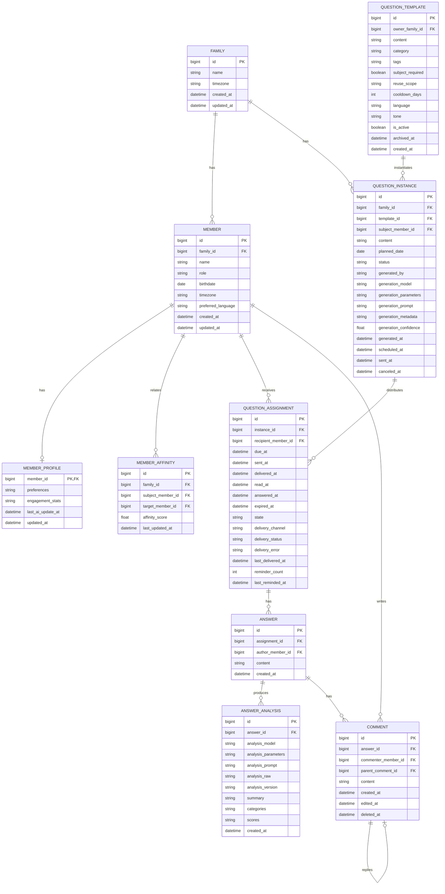

## 온식구 AI - ERD

아래 다이어그램은 가족당 하루 하나의 질문만 진행한다는 제약을 전제로 한 전체 모델입니다.

```mermaid
erDiagram
  FAMILY ||--o{ MEMBER : has
  MEMBER ||--o| MEMBER_PROFILE : has
  MEMBER ||--o{ MEMBER_AFFINITY : relates
  FAMILY ||--o{ QUESTION_INSTANCE : has
  QUESTION_TEMPLATE ||--o{ QUESTION_INSTANCE : instantiates
  QUESTION_INSTANCE ||--o{ QUESTION_ASSIGNMENT : distributes
  MEMBER ||--o{ QUESTION_ASSIGNMENT : receives
  QUESTION_ASSIGNMENT ||--o{ ANSWER : has
  ANSWER ||--o{ ANSWER_ANALYSIS : produces
  ANSWER ||--o{ COMMENT : has
  MEMBER ||--o{ COMMENT : writes
  COMMENT ||--o| COMMENT : replies

  FAMILY {
    bigint id PK
    string name
    string timezone
    datetime created_at
    datetime updated_at
  }

  MEMBER {
    bigint id PK
    bigint family_id FK
    string name
    string role
    date birthdate
    string timezone
    string preferred_language
    datetime created_at
    datetime updated_at
  }

  MEMBER_PROFILE {
    bigint member_id PK, FK
    string preferences
    string engagement_stats
    datetime last_ai_update_at
    datetime updated_at
  }

  MEMBER_AFFINITY {
    bigint id PK
    bigint family_id FK
    bigint subject_member_id FK
    bigint target_member_id FK
    float affinity_score
    datetime last_updated_at
  }

  QUESTION_TEMPLATE {
    bigint id PK
    bigint owner_family_id FK
    string content
    string category
    string tags
    boolean subject_required
    string reuse_scope
    int cooldown_days
    string language
    string tone
    boolean is_active
    datetime archived_at
    datetime created_at
  }

  QUESTION_INSTANCE {
    bigint id PK
    bigint family_id FK
    bigint template_id FK
    bigint subject_member_id FK
    string content
    date planned_date
    string status
    string generated_by
    string generation_model
    string generation_parameters
    string generation_prompt
    string generation_metadata
    float generation_confidence
    datetime generated_at
    datetime scheduled_at
    datetime sent_at
    datetime canceled_at
  }

  QUESTION_ASSIGNMENT {
    bigint id PK
    bigint instance_id FK
    bigint recipient_member_id FK
    datetime due_at
    datetime sent_at
    datetime delivered_at
    datetime read_at
    datetime answered_at
    datetime expired_at
    string state
    string delivery_channel
    string delivery_status
    string delivery_error
    datetime last_delivered_at
    int reminder_count
    datetime last_reminded_at
  }

  ANSWER {
    bigint id PK
    bigint assignment_id FK
    bigint author_member_id FK
    string content
    datetime created_at
  }

  ANSWER_ANALYSIS {
    bigint id PK
    bigint answer_id FK
    string analysis_model
    string analysis_parameters
    string analysis_prompt
    string analysis_raw
    string analysis_version
    string summary
    string categories
    string scores
    datetime created_at
  }

  COMMENT {
    bigint id PK
    bigint answer_id FK
    bigint commenter_member_id FK
    bigint parent_comment_id FK
    string content
    datetime created_at
    datetime edited_at
    datetime deleted_at
  }
```

참고: Mermaid에서는 유니크/체크 제약을 직접 표현하기 어렵습니다. DB 스키마에서 `QUESTION_INSTANCE (family_id, planned_date)` 유니크 제약으로 가족당 하루 1건을 강제하세요.

